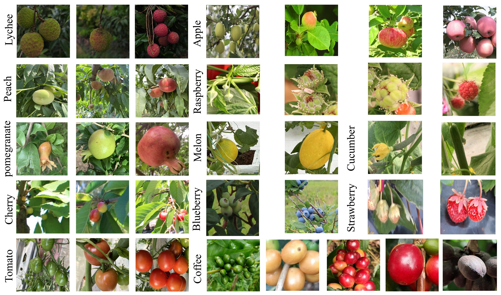

# CDFRB: A Large-Scale Benchmark and A Robust Deep Learning Model for In-the-Wild Fruit Ripeness Detection


## Abstract
Accurately grading the maturity of multiple fruit types in an uncontrolled orchard environment is key to automated harvesting, but this is limited by the gap between category diversity and scene realism in 
existing datasets. To address this challenge, this paper first constructs and proposes the first large-scale fruit maturity benchmark CDFRB that balances diversity and realism, integrating a total of 
18,788 images across 12 distinct fruit species and 36 fine-grained ripeness levels.

## The CDFRB Dataset

### Download

The dataset used in this study will be made publicly available in a repository upon acceptance of the manuscript.

* **Google Drive**: [**Link**](https://docs.google.com/forms/d/e/1FAIpQLSc3sBqmMQUEP_J2LRbqS-s5HZaRWCiWDGGM2oXFX3unJhbtoQ/viewform?usp=publish-editor)

### Composition

CDFRB was constructed by integrating 12 publicly available fruit datasets annotated with maturity levels, ultimately forming a hierarchical labeling system with 36 independent categories.

**Table 1. Fruit categories and their maturity levels in the CDFRB.**

| Fruit Category | Maturity Levels | Number of levels |
| :--- | :--- | :---: |
| Apple | `Pre_growth`, `Young`, `Late_growth`, `ripe` | 4 |
| Blueberry | `unripe`, `ripe` | 2 |
| Cherry | `unripe`, `semi_ripe`, `ripe`, `green` | 4 |
| Coffee Fruit | `dry`, `overripe`, `ripe`, `semi_ripe`, `unripe`| 5 |
| Cucumber | `unripe`, `ripe` | 2 |
| Lichi | `green`, `semi_ripe`, `ripe` | 3 |
| Melon | `unripe`, `ripe` | 2 |
| Peach | `unripe`, `semi_ripe`, `ripe` | 3 |
| Pomegranate | `unripe`, `semi_ripe`, `ripe` | 3 |
| Raspberry | `unripe`, `Growing`, `semi_ripe`, `ripe` | 4 |
| Strawberries | `unripe`, `ripe` | 2 |
| Tomato | `unripe`, `semi_ripe`, `ripe` | 3 |
| **Total** | | **36** |

## Visualization

The figure below shows examples of 12 fruits in the CDFRB dataset at different stages of maturity.



## Citation

If you find our dataset or model useful in your research, please consider citing our work. Thank you!

```bibtex
@article{zhang2026detecting,
  title={Detecting fruit ripeness in the wild: A robust deep learning model and the comprehensive and diverse fruit ripeness benchmark},
  author={Zhang, Xiaorong and Liao, Han and Xu, Yong},
  journal={Engineering Applications of Artificial Intelligence},
  volume={168},
  pages={113990},
  year={2026},
  publisher={Elsevier}
}


